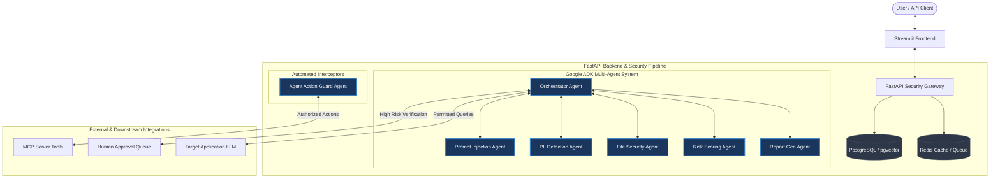
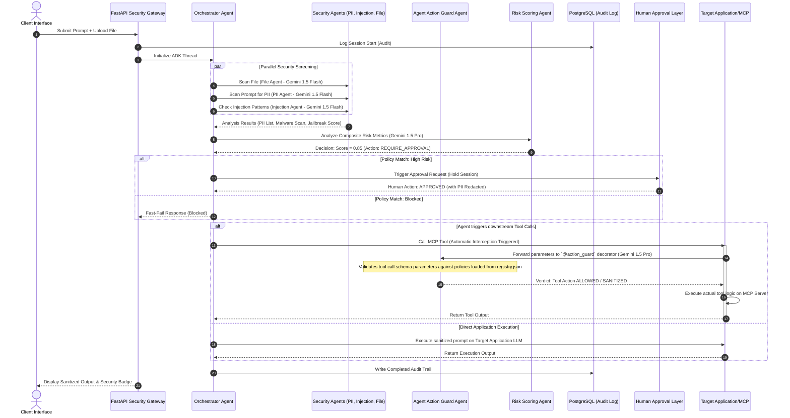

# AgentShield-X: Production-Grade Multi-Agent Security Architecture
*Designed for the Kaggle AI Agents Capstone*

AgentShield-X is an enterprise-grade AI security gateway designed to intercept, analyze, and sanitize interactions between users/organizations and downstream AI agents. By utilizing a multi-agent topology built with the **Google Agent Development Kit (ADK)**, AgentShield-X protects against prompt injection, phishing, data leakage (PII), malicious file execution, and unauthorized agent actions.

---

## 1. System Architecture Overview

AgentShield-X operates as a security middleware layer. It sits between client interfaces (e.g., Streamlit frontend or API clients) and execution engines (downstream LLMs, MCP servers, or databases).



---

## 2. Google ADK Agent Responsibilities & Model Mapping

Each agent in AgentShield-X is represented as a specialized **ADK Agent** configured with focused system prompts, local memories, and specialized tools.

| Agent Name | LLM Engine | Key Responsibility | Local Tools & Libraries |
| :--- | :--- | :--- | :--- |
| **Orchestrator Agent** | **Gemini 1.5 Pro** | Coordinator of the ADK thread, routes sub-tasks, manages human approval queue state. | Client session Router, Human escalation callback hook, Downstream proxy dispatcher. |
| **Prompt Injection Agent** | **Gemini 1.5 Flash** | Detects input attacks, system instructions bypasses, and adversarial jailbreak attempts. | Cosine similarity vector search tool (against pgvector database of known injection signatures). |
| **PII Detection Agent** | **Gemini 1.5 Flash** | Recognizes personal identifiers (SSNs, API keys, credentials) and applies token masking. | Named Entity Recognition (NER) model wrapper, RegEx matching engines, tokenization lookup maps. |
| **File Security Agent** | **Gemini 1.5 Flash** | Scans attachments locally to detect potential malware, unsafe scripts, or exploits. | Local YARA rule library, Metadata inspector, PDF scanner, Office document parser (`python-docx`/`openpyxl`). |
| **Agent Action Guard Agent** | **Gemini 1.5 Pro** | *Automated Interceptor*: Evaluates all tool call parameters and actions before dispatching them downstream. | Shell command parser, argument schema validator, exfiltration heuristic scanner, permission registry lookup. |
| **Risk Scoring Agent** | **Gemini 1.5 Pro** | Analyzes the consolidated reports from other agents to compute a final risk score. | Policy matrix engine. |
| **Report Gen Agent** | **Gemini 1.5 Pro** | Formats session run statistics and compliance audits for developers and admins. | Markdown layouts, PDF compilers. |

---

## 3. Agent Communication & Lifecycle Flow

AgentShield-X uses an asynchronous event-driven layout inside the Google ADK context to orchestrate agent coordination. Tool calls and external API actions are automatically wrapped with the Action Guard decorator, insulating the execution targets from raw agent prompts.



---

## 4. Local File Security Sandbox Specification

To meet capstone security guidelines without external paid services, the **File Security Agent** runs a local Python sandboxed framework consisting of:
1. **Metadata Inspector**: Extracts and validates MIME types, verifying actual structure against declared extensions (e.g. validating magic bytes `0x25 0x50 0x44 0x46` for PDF).
2. **YARA Rules Engine**: Uses the `yara-python` interface. Scans files for structural signatures indicating macro autostart functions (e.g. `Document_Open`, `AutoOpen`), active payloads, shellcode scripts, or hidden PE structures in document attachments.
3. **Clean XML Extractor**: Extracts text from `.docx` and `.xlsx` using internal python libraries to bypass malicious formatting, stripping active hyperlinks or embedded VBA projects before transferring data to subsequent agents.

---

## 5. Agent Action Guard & Configurable Policies

The **Agent Action Guard Agent** acts as an inline policy decision point (PDP) for tool execution. Its dynamic screening parameters are loaded directly from [registry.json](file:///C:/Users/vaish/Desktop/Projects/AgentShield-X/backend/app/mcp/registry.json).

### Policy Configuration Schema
The gateway security policies are organized in four core domains within `registry.json`:

1. **MCP Server Permissions**:
   - `allowed_categories`: Specific groups of tools authorized for use (e.g., `file_read`, `search`).
   - `allowed_tools`: Whitelist of authorized tool call names.
   - `blocked_tools`: Explicit blacklist of tools prohibited under any execution scope.
2. **Network Policies**:
   - `allowed_domains`: Allowlist of web domains the agent can interact with via REST/HTTP or scraping utilities.
   - `block_unknown_domains`: Boolean switch forcing structural validation checks on target URLs.
3. **API Policies**:
   - `allowed_scopes`: List of valid authorization keys or OAuth parameters allowed in outgoing headers.
   - `enforced_scopes`: Enforces credentials configuration requirements.
4. **Execution Policies**:
   - `block_destructive_operations`: Blocks executions matching destructive keywords (e.g., database table removals or file deletes).
   - `block_sensitive_exports`: Screens output payloads for mass-data exfiltration (e.g. searching outputs for high quantities of target regex variables).

---

## 6. Database Schema & Vector Matching

### Primary Storage: PostgreSQL with `pgvector` extension
1. **`audit_logs` Table**:
   - `log_id` (UUID, PK)
   - `session_id` (UUID, Indexed)
   - `timestamp` (DateTime)
   - `raw_input` (Text, encrypted at rest via AES-GCM-256)
   - `sanitized_input` (Text)
   - `overall_risk_score` (Float)
   - `policy_action` (Enum: `ALLOW`, `BLOCK`, `REDACTED`, `HUMAN_REVIEW`)
2. **`security_events` Table**:
   - `event_id` (UUID, PK)
   - `session_id` (FK)
   - `agent_source` (Enum: `INJECTION`, `PII`, `FILE`, `ACTION_GUARD`, `RISK_SCORE`)
   - `trigger_type` (String, e.g., "Jailbreak attempt", "Malicious Macro found", "SSN Exposed", "Dangerous Command Blocked")
   - `severity_level` (Enum: `LOW`, `MEDIUM`, `HIGH`, `CRITICAL`)
   - `metadata` (JSONB)
3. **`exploit_signatures` Table (Vector Indexing)**:
   - `signature_id` (UUID, PK)
   - `exploit_pattern` (Text)
   - `embedding` (Vector(1536))
   - `added_at` (DateTime)

---

## 7. Project Directory Tree

```text
AgentShield-X/
├── backend/
│   └── app/
│       ├── __init__.py
│       ├── main.py                    # FastAPI gateway entrypoint
│       ├── api/                       # API routing layer
│       │   ├── __init__.py
│       │   ├── dependencies.py        # Database sessions, authentication, rate limits
│       │   └── endpoints/
│       │       ├── __init__.py
│       │       ├── approval.py        # Endpoint for human-in-the-loop review operations
│       │       ├── audit.py           # Endpoint for query logs and compliance checks
│       │       └── gateway.py         # Primary proxy gateway input route
│       ├── core/                      # Settings and central engine setup
│       │   ├── __init__.py
│       │   ├── config.py              # Environment settings (Pydantic Settings)
│       │   ├── database.py            # PostgreSQL engine, sessionmaker, vector config
│       │   └── security.py            # Cipher protocols and JWT authorization utilities
│       ├── models/                    # SQLAlchemy database tables
│       │   ├── __init__.py
│       │   ├── approval.py            # Human verification transaction tables
│       │   └── audit.py               # Session logging and security event tables
│       ├── schemas/                   # Pydantic schemas (validations)
│       │   ├── __init__.py
│       │   ├── request.py             # Client schemas
│       │   └── response.py            # Sanitized proxy return schemas
│       ├── agents/                    # Google ADK agent specifications
│       │   ├── __init__.py
│       │   ├── base.py                # Abstract class specifying model contexts and tool bindings
│       │   ├── orchestrator.py        # Coordinate task flows and routing (Gemini 1.5 Pro)
│       │   ├── prompt_injection.py    # Classify input injection likelihoods (Gemini 1.5 Flash)
│       │   ├── pii_detection.py       # Recognize and mask target data (Gemini 1.5 Flash)
│       │   ├── file_security.py       # Execute macro scanning and parsing (Gemini 1.5 Flash)
│       │   ├── agent_action_guard.py  # Intercept and validate MCP actions (Gemini 1.5 Pro)
│       │   ├── risk_scoring.py        # Compute final composite risk score (Gemini 1.5 Pro)
│       │   └── report_generation.py   # Render security reports (Gemini 1.5 Pro)
│       └── mcp/                       # Model Context Protocol support
│           ├── __init__.py
│           ├── integration.py         # Sub-process connectors for external tooling
│           └── registry.json          # Configuration mapping for available MCP hosts
├── frontend/                          # Streamlit front-end UI
│   ├── app.py                         # Streamlit application run file
│   ├── components/                    # Reusable web interface modular templates
│   │   ├── approval_console.py       # Review console for administrators
│   │   ├── chat_interface.py         # Chat console for testing security sanitization
│   │   └── security_report.py        # Interactive auditing visual logs
│   └── pages/
├── reports/                           # Output directory for agent-generated security compliance files
│   └── templates/                     # Layout templates (Markdown/HTML structure)
├── migrations/                        # Alembic database migration scripts
├── tests/                             # Target test directory
│   ├── conftest.py                    # Database and client test configurations
│   ├── test_agents/                   # Unit test suite verifying security outputs
│   └── test_api/                      # Endpoint integration tests
├── README.md
└── requirements.txt
```

---

## 8. Deployment Architecture

AgentShield-X runs inside containerized environments where security critical elements are isolated.

```text
                                  +---------------------------------------+
                                  |         Ingress / Load Balancer       |
                                  |      (SSL Termination, JWT Auth)      |
                                  +---------------------------------------+
                                                      |
                                     +----------------+----------------+
                                     |                                 |
                                     v                                 v
                     +-------------------------------+ +-------------------------------+
                     |     Streamlit UI Container    | |    FastAPI Gateway Container  |
                     |      (Stateless Frontend)     | |        (Stateful Backend)     |
                     +-------------------------------+ +-------------------------------+
                                                                       |
                            +------------------------------------------+-----------------------+
                            |                                          |                       |
                            v                                          v                       v
            +---------------------------------+        +-------------------------------+ +-------------+
            |      Google ADK Engine Pod      |        |        Sandbox Engine         | | Redis Cache |
            | (Runs isolation pipeline rules) |        |   (gVisor / Firecracker Pod)  | | (Broker/RL) |
            +---------------------------------+        | (Unsafe file/script execution)| +-------------+
                            |                          +-------------------------------+
                            v                                          |
            v                                                          v
            +---------------------------------+                        +------------------------------+
            |       PostgreSQL DB Instance    |                        |     External MCP Server      |
            | (Stores logs, audit records,    |                        |    (Isolated Network DMZ)    |
            | vector index for injections)    |                        +------------------------------+
            +---------------------------------+
```
