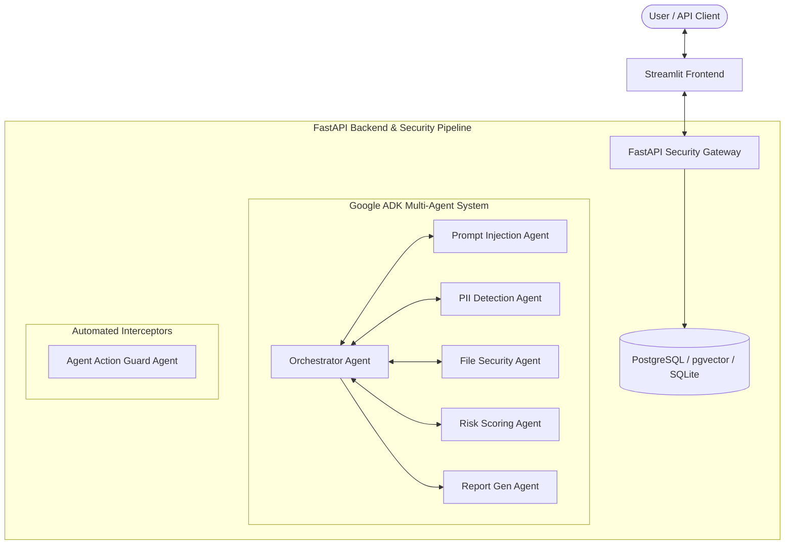

# AgentShield-X: Enterprise AI Security Gateway Walkthrough
*Designed for the Kaggle AI Agents Capstone*

AgentShield-X is a production-ready AI security gateway engineered to protect users and downstream LLM agents from adversarial attacks, PII leaks, malicious files, and unauthorized tool executions. 

---

## 1. Multi-Agent Safety Pipeline Architecture

AgentShield-X implements a pipeline of specialized agents utilizing the **Google Agent Development Kit (ADK)**:



### Agent Roles & Model Map:
1. **Orchestrator Agent (Gemini 1.5 Pro)**: Central coordinator managing thread lifecycles, database audits, and downstream proxy execution.
2. **Prompt Injection Agent (Gemini 1.5 Flash)**: Identifies adversarial jailbreaks,DAN modes, and system override attempts using a hybrid scanner (Gemini semantic parsing + Cosine similarity vector search).
3. **PII Detection Agent (Gemini 1.5 Flash)**: Intercepts personal identifiers (SSNs, emails, API keys) and applies token masking with redaction placeholders.
4. **File Security Agent (Gemini 1.5 Flash)**: Sandbox parser that checks attachments locally using MIME type inspection, YARA macro signatures, and clean text parsers (`pdfminer.six`/`python-docx`/`openpyxl`).
5. **Agent Action Guard (Gemini 1.5 Pro)**: Policy Decision Point intercepting MCP tool executions automatically to block destructive keywords, unauthorized domains, and credential leaks.
6. **Risk Scoring Agent (Gemini 1.5 Pro)**: Aggregates sub-agent alerts to calculate a composite security index (0.0 = Safe, 1.0 = High Threat) and enforce policy actions (`ALLOW`, `REDACTED`, `BLOCK`, `HUMAN_REVIEW`).
7. **Report Generation Agent (Gemini 1.5 Pro)**: Formats session run statistics and compliance audits for administrators.

---

## 2. Security Controls & Capabilities

### Local File Sandbox Security
The sandbox performs local checks without relying on paid external APIs:
* **MIME Validation**: Verifies headers and magic bytes (e.g. `%PDF` for PDF, `PK\x03\x04` for Office ZIP).
* **YARA Rule Scanner**: Uses YARA rules to screen files for active macro trigger points (`Document_Open`, `AutoOpen`), embedded PE headers (`MZ`), and scripting indicators in PDFs (`/JavaScript`).
* **Text Parser Sandbox**: Parses `.pdf`, `.docx`, and `.xlsx` files into clean, raw text streams, stripping out active formatting, VBA projects, or hyperlinks before handing data down the pipeline.

### Agent Action Guard & Policy Registry
All downstream tool executions are intercepted by the `@action_guard` decorator. Policies are evaluated dynamically from `registry.json` across:
* **Allowed MCP Servers**: Whitelist of permitted tools (`list_dir`, `view_file`, `grep_search`, `search_web`, `read_url_content`) and blacklist of prohibited tools (`write_to_file`, `delete_file`).
* **Network Firewall**: Restricts outgoing HTTP calls only to authorized domains (e.g., `api.github.com`, `huggingface.co`).
* **Execution Block**: Heuristically blocks destructive keywords (`rm`, `rf`, `drop`, `delete`) and exfiltrating categories of outputs.

---

## 3. Database Layer & Compliance Audits

AgentShield-X uses a hybrid model supporting either SQLite for fast development testing, or PostgreSQL with pgvector for production search scaling:
* **Audit Trail**: Full transactional history of incoming prompts (AES-GCM-256 encrypted at rest), sanitized prompts, risk scores, and decisions.
* **Security Events**: Granular events logs detailing triggers, agents, severity levels, and parameters.
* **Exploit Vector Index**: Stores 1536-dimensional embeddings of known jailbreak vectors to enable fast cosine similarity scanning.

---

## 4. Run Instructions

### 1. Build and Start Container Services
```bash
docker-compose up --build
```
This builds and starts four services:
* **db**: PostgreSQL database preloaded with the pgvector extension.
* **redis**: Queue and cache service.
* **backend**: FastAPI gateway on port `8000`.
* **frontend**: Streamlit application on port `8501`.

### 2. Streamlit Dashboard Panel
Browse to `http://localhost:8501`:
1. **Security Playground (Chat)**: Submit text prompts and attach files to simulate security routing.
2. **Admin Queue**: Access with username/password (`admin`/`admin`) to approve or reject held requests.
3. **Audit Registry**: Search compliance logs and inspect raw vs. sanitized payloads.
